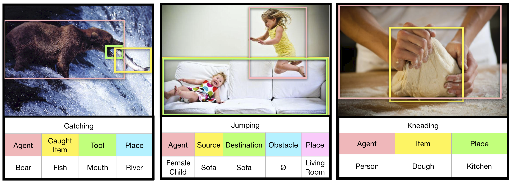

 ## Overview

This repository contains the Situation With Groundings (SWiG) dataset as
 well as code to train and run inference on the Joint Situtaion Localizer (JSL).
 This is a model which solves the Grounded Situation Recognition (GSR) task. The SWiG
 dataset, JSL model, and the GSR task are all detailed in https://arxiv.org/abs/2003.12058.
 This document details how to
 1. Download the SWiG dataset
 2. Run inference on JSL
 3. Train JSL
 
 
 ## 1. SWiG Dataset
 
 
  
  
  Each image in the SWiG dataset is associated with 3 pieces of information. Verb, frame and grounding.
  
  (a) Verb:
each image is associated with one of 504 visually groundable verbs (one
in which it is possible to view the action, for example, talking is visible, but
thinking is not). 

(b) Frame: this consists of 1 to 6 semantic role values i.e. nouns
associated with the verb (each verb has its own pre-defined set of roles). For example, the l
final image in the above figure consists of the verb "kneading" and the roles "Agent", "Item", 
and "Place".
Every image labeled with the verb kneading will have the same roles but may have
different nouns filled in at each role based on the contents of the image. A role
value can also be ∅ indicating that a role does not exist in an image (such as the 
obstacle in the second image). The SWiG dataset has 3 nouns for each role given by 3 different annotators.


(c) Groundings: each grounding is described with coordinates [x1, y1, x2, y2] if
the noun in grounded in the image. It is possible for a noun to be labeled in the
frame but not grounded, for example in cases of occlusion.

 
 
  ## 2. Inference on  JSL
  
  To run inference on a set of custom images first download or clone this repository and download the 
  images using the steps detailed above. Additionally, you will need a set of verb classification weights and a
  set of weights for the primary noun/detection portion of the model. You can use your own weights or you can
 use these weights from the original paper. You will also need to specify what images you want the model
 to processes. You can specify this wil a text file where each line of the file contains the path to one 
 image. All images should have a unique name. You can then run inference by navigating into the primary folder and running:
 
 ```python ./JSL/inference --verb-path ./path/to/verb/weights --jsl-path ./path/to/detection/weights --image-file ./path/to/image/path --batch-size batch_size```
 
  Results will be written to results.json which will contain a prediction for each role in the image and a grounding for each prediction 
  (groundings may be null). Additionally, you can use the ```--store-features``` flag which will write the local ResNet features for each object to and
  hdf5. When no grounding is predict, it just uses the features for the entire image.  
  
   ## 3. Training JSL
   
   We have seperated the training of JSL into training the verb prediction portion of the model and then training the 
   primary noun and detection portion of the model. These portions only need to be combined at evalutation so we seperate them out
   to allow for greater flexibility adjusting these models in the future.  
   
   All of the code for training the verb classifier is under ./JSL/verb. All model checkpoints and tensorboard events are saved in ./JSL/verb/runs. 
   Train the verb classifier by running the below command from the main folder.
   
   ```python ./JSL/verb/main.py```
   
   
   All of the code for training the detection and classification is under ./JSL/gsr with some file in ./global_utils. All model checkpoints and tensorboard events are saved in ./JSL/gsr/runs. 
   Additionally, you must specify the SWiG train file and val file using the corresponding flags. You must also specify a class file, such as the file 'train_classes.csv' which indicates all training
   classes. Any noun in either the train file or the val file not specified in this csv will be considered out of vocabulary. Use the below command and flags to specify these files
   and train your model.
   
   ```python ./JSL/gsr/train.py --train-file ./SWiG_jsons/train.json --val-file ./SWiG_jsons/dev.json --classes-file ./global_utils/train_classes.csv --batch-size batch_size```
 

  ## 4. Citing
  If you find this project useful in your research, please consider citing:


  ``` 
  @article{Pratt2020Swig,
  title={Grounded Situation Recognition},
  author={Sarah Pratt and Mark Yatskar and Luca Weihs and Ali Farhadi and Aniruddha Kembhavi},
  journal={ArXiv},
  year={2020},
  volume={abs/2003.12058}
  }
  ```